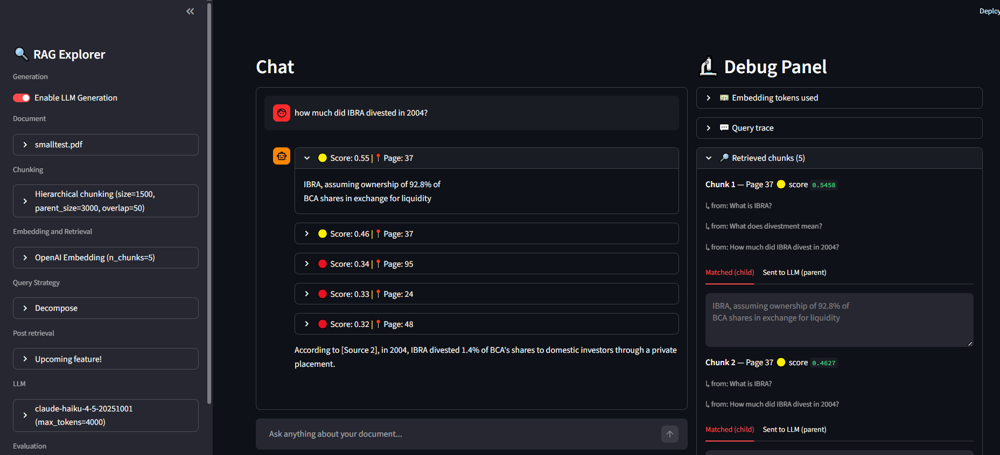

# RAG Explorer

Try every RAG configuration and find the best for your needs. Upload a document and tinker the settings.

The debug panel shows exactly what happened like which chunks were retrieved, what scores they got, how the query was transformed, and which sub-question each chunk came from.



---

## What it does

- Upload any PDF and index it with your chosen configuration
- Ask questions and get answers grounded in the document
- Explore how different RAG settings change retrieval quality
- Use it without an LLM API key as generation is optional

---

## Setup

```bash
git clone https://github.com/justinjedidiah/rag-explorer
cd rag-explorer
pip install -r requirements.txt
streamlit run app.py
```

API keys are optional, the retrieval process will still run even with no generation.
Optionally, you can use your keys on the app or create a `.env` file for your keys to prevent copy pasting over and over:

```
ANTHROPIC_API_KEY=sk-ant-...
OPENAI_API_KEY=sk-...
```

---

## What you can configure

### Chunking
How the PDF is split before indexing.

| Strategy | How it works |
|---|---|
| Fixed size | Splits by character count. Fast and simple, but cuts mid-sentence. |
| Semantic | Respects paragraph and sentence boundaries. Better context per chunk. |
| Hierarchical | Indexes small chunks for precise matching, but returns the full parent paragraph to the LLM. |

---

### Embedding and retrieval

How chunks are represented and searched.

| Model | Type | Notes |
|---|---|---|
| all-MiniLM-L6-v2 | Dense | Free, fast, runs locally. Good starting point. |
| BAAI/bge-large-en-v1.5 | Dense | Free, better quality, slower. |
| OpenAI Embedding | Dense | Paid, high quality. Requires OpenAI API key. |
| BM25 | Sparse | Keyword matching, no neural model. Wins on exact terms, names, codes. |

---

### Query strategy

Transforms the user's question before retrieval. Can significantly improve what gets found.

| Strategy | What it does | Requires LLM |
|---|---|---|
| None | Raw question goes straight to retrieval | No |
| Rewrite | LLM rewrites the question for better search clarity | Yes |
| HyDE | LLM generates a fake answer, that answer is embedded and used for search | Yes |
| Decompose | LLM splits complex questions into sub-questions, retrieves for each, merges results | Yes |


---

## The debug panel

Every question shows a full trace of what happened:

- **Query trace** — the original question, and how it was transformed (rewritten, HyDE document, or sub-questions)
- **Retrieved chunks** — each chunk with its page number, similarity score, and which sub-question retrieved it. For hierarchical chunking, shows the small matched chunk and the full parent chunk sent to the LLM
- **Process log** — which steps ran and which were disabled

Score colors: 🟢 high (≥0.7) · 🟡 medium (≥0.4) · 🔴 low (<0.4)

---

## Requirements

```
streamlit
pymupdf
sentence-transformers
langchain-text-splitters
chromadb
bm25s
PyStemmer
anthropic       # for Claude
openai          # for OpenAI
python-dotenv
```